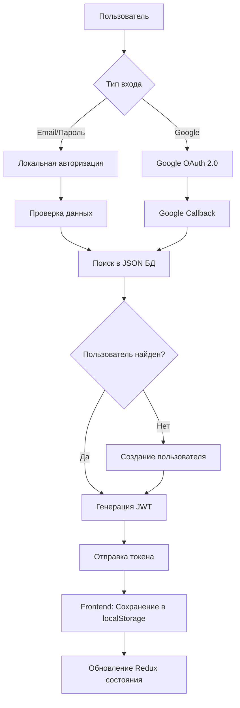

# 📚 Документация по авторизации - FarmSharing

## 🎯 Быстрый старт

### 🔑 Тестовые аккаунты
- **Email:** `test@example.com` | **Пароль:** `password123`
- **Email:** `admin@example.com` | **Пароль:** `password123` (админ)

### 🌐 Google OAuth
- Кнопка "Продолжить с Google" в форме входа
- Автоматическое создание аккаунта при первом входе

---

## 📖 Полная документация

### 📄 Основные руководства

1. **[auth-complete-guide.md](./auth-complete-guide.md)** 📋
   - 🔐 Система авторизации (локальная + Google OAuth)
   - 🗃️ JSON база данных пользователей
   - 🛡️ JWT токены и безопасность
   - 🌍 Многоязычность
   - 🧪 Тестирование и отладка

2. **[latest-updates.md](./latest-updates.md)** 🚀
   - ✨ Последние изменения в проекте
   - 🐛 Исправленные ошибки
   - 📊 Миграция на JSON базу данных
   - 🛠️ Автоматизация процессов

3. **[auth-testing-guide.md](./auth-testing-guide.md)** 🧪
   - 🧪 Тестирование авторизации
   - 📱 Postman коллекция
   - 🔍 Отладка ошибок

---

## 🏗️ Архитектура авторизации



---

## 🗃️ База данных

### 📁 Структура файлов
```
data/
├── users.json         # 👥 Хранилище пользователей
└── userDatabase.cjs   # 🔧 API для работы с JSON
```

### 👤 Формат пользователя
```json
{
  "id": 1,
  "name": "Иван Петров",
  "email": "ivan@example.com",
  "password": "$2b$10$...", // bcrypt hash
  "phone": "+7 (999) 123-45-67",
  "address": "ул. Пушкина, д. 10, кв. 5",
  "preferredLanguage": "ru",
  "role": "user",
  "createdAt": "2024-01-01T10:00:00Z",
  "updatedAt": "2024-01-20T15:30:00Z",
  "googleId": "123456789" // только для Google пользователей
}
```

---

## 🌐 API Endpoints

### 🔐 Авторизация
- `POST /api/auth/register` - Регистрация нового пользователя
- `POST /api/auth/login` - Вход по email/паролю
- `GET /api/auth/google` - Инициация Google OAuth
- `GET /api/auth/google/callback` - Обработка Google callback

### 👤 Пользователь
- `GET /api/auth/profile` - Получение профиля пользователя
- `PUT /api/auth/profile` - Обновление профиля

### 📊 Администрирование
- `GET /api/admin/users/stats` - Статистика пользователей

---

## 🔧 Настройка окружения

### 📄 Файл `.env`
```env
GOOGLE_CLIENT_ID=your-google-client-id
GOOGLE_CLIENT_SECRET=your-google-client-secret
JWT_SECRET=your-secure-jwt-secret-key-here
PORT=3000
NODE_ENV=development
```

### 🌐 Google Cloud Console
1. Создать проект в [Google Cloud Console](https://console.cloud.google.com/)
2. Настроить OAuth consent screen
3. Создать OAuth 2.0 credentials
4. Добавить redirect URI: `http://localhost:3000/api/auth/google/callback`

---

## 🧪 Тестирование

### 🔍 Быстрая проверка
```bash
# Запуск сервера и клиента
npm run dev

# Или отдельно
npm run dev:server  # http://localhost:3000
npm run dev:client  # http://localhost:5173
```

### 🌐 Тест авторизации
1. Открыть http://localhost:5173
2. Нажать "Войти" в хедере
3. Протестировать:
   - ✅ Локальный вход (`test@example.com` / `password123`)
   - ✅ Google OAuth (кнопка "Продолжить с Google")
   - ✅ Регистрацию нового пользователя

### 📊 Проверка базы данных
```bash
# Просмотр статистики пользователей
curl http://localhost:3000/api/admin/users/stats
```

---

## 🆘 Решение проблем

### 🚨 Частые ошибки

1. **Порт 3000 занят**
   ```bash
   npm run kill-processes
   ```

2. **Google OAuth не работает**
   - Проверить переменные в `.env`
   - Убедиться в правильности redirect URI
   - Проверить статус OAuth consent screen

3. **Ошибки JWT**
   - Проверить `JWT_SECRET` в `.env`
   - Убедиться в корректности токена

4. **Пользователи не сохраняются**
   - Проверить файл `data/users.json`
   - Проверить логи в консоли сервера

---

## 🔒 Безопасность

### ✅ Реализовано
- 🔐 Хеширование паролей (bcrypt)
- 🛡️ JWT токены с временем жизни
- 🌐 CORS политики
- 📝 Валидация входных данных

### 🚨 Для продакшена
- ✅ HTTPS обязательно
- ✅ Безопасный JWT_SECRET
- ✅ Rate limiting
- ✅ 2FA рекомендуется

---

**📅 Последнее обновление:** Январь 2025  
**👨‍💻 Статус:** ✅ Готово к использованию